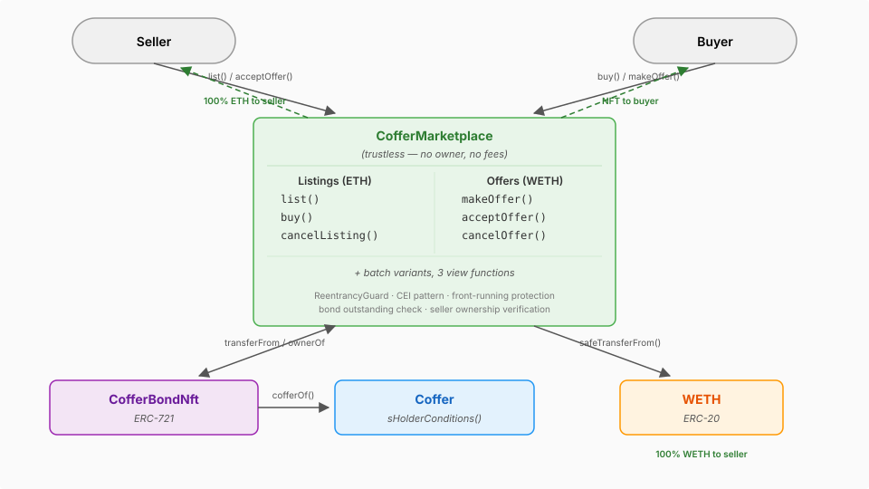

# Coffer Marketplace

A secondary marketplace for trading [Coffer Bond NFTs](#what-is-a-coffer-bond-nft). Two trading mechanisms are supported: **ETH listings** (seller sets a price, buyer pays ETH) and **WETH offers** (buyer deposits an offer in WETH, seller accepts).

Built with Solidity ^0.8.33, [Foundry](https://book.getfoundry.sh/), and OpenZeppelin (`ReentrancyGuard`, `SafeERC20`).

> **Trustless design** — the contract has no owner, no admin functions, and no fee system. All payments go directly between buyers and sellers with zero intermediary extraction.

---

## What is a Coffer Bond NFT?

A Coffer Bond NFT is an ERC-721 token representing a fixed-income bond from a validator. When a holder sends ETH to a Coffer (validator) contract, they receive an NFT encoding:

- **Maturity value** — the ETH amount owed at maturity
- **Duration** — the bond term in seconds
- **Start timestamp** — when the bond was created

A bond is considered **outstanding** while its `bondMaturityValue != 0`. The marketplace only allows trading outstanding bonds. Bonds may mature, be partially withdrawn, or be early-redeemed by the validator — any of these can zero out the maturity value and invalidate the bond for trading.

---

## How the Marketplace Works

### Listings (ETH)

1. Seller approves the marketplace and calls `list()` with a price and expiration.
2. Buyer calls `buy()` with ETH covering the price.
3. The NFT transfers from seller to buyer; ETH goes to the seller.

### Offers (WETH)

1. Buyer approves WETH spending, then calls `makeOffer()` with a WETH amount and expiration.
2. Seller approves the marketplace and calls `acceptOffer()`.
3. WETH is pulled from the buyer and sent to the seller; the NFT transfers to the buyer.

### Safety Mechanisms

- **Front-running protection** — `buy()` takes `_expectedPrice` and `acceptOffer()` takes `_expectedAmount`. The transaction reverts if the on-chain value differs.
- **CEI pattern** — state is deleted before any external calls.
- **ReentrancyGuard** — applied to all functions that perform external calls (`buy`, `acceptOffer`, `batchList`, `batchBuy`, `batchMakeOffers`, `batchAcceptOffers`).
- **Bond outstanding check** — every trade verifies the bond's maturity value is non-zero.

---

## Prerequisites

- [Foundry](https://book.getfoundry.sh/) installed
- Node.js (for [solhint](https://protofire.github.io/solhint/))
- Deployed `CofferBondNft` and `WETH` contracts

---

## Getting Started

```bash
# Compile
forge build

# Run tests (1024 fuzz runs)
forge test

# Coverage report (excludes test/ and script/)
forge coverage --no-match-coverage "^test/|^script/" --report summary

# Lint (format check + solhint)
make lint

# Static analysis
slither .
```

---

## Deployment

Set environment variables, then run the deploy script:

```bash
export WETH_ADDRESS=0x...
export BOND_NFT_ADDRESS=0x...

forge script script/DeployCofferMarketplace.s.sol \
  --rpc-url <RPC_URL> --broadcast --verify
```

---

## Usage

### Selling via Listing

```
1. Seller: cofferBondNft.setApprovalForAll(marketplace, true)
2. Seller: marketplace.list(bondId, price, expiration)
3. Buyer:  marketplace.buy(bondId, expectedPrice)             {value: price}
```

### Selling via Offer

```
1. Buyer:  weth.approve(marketplace, amount)
2. Buyer:  marketplace.makeOffer(bondId, wethAmount, expiration)
3. Seller: cofferBondNft.setApprovalForAll(marketplace, true)
4. Seller: marketplace.acceptOffer(bondId, buyer, expectedAmount)
```

### Cancelling

```
marketplace.cancelListing(bondId)
marketplace.cancelOffer(bondId)
```

### Batch Operations

All single operations have batch counterparts for gas-efficient multi-bond transactions:

- `batchList`, `batchBuy`, `batchCancelListings`
- `batchMakeOffers`, `batchCancelOffers`, `batchAcceptOffers`

### View Functions

- `isListingValid(bondId)` — checks listing exists, not expired, seller still owns NFT, bond outstanding
- `isOfferValid(bondId, buyer)` — checks offer exists, not expired, buyer has sufficient WETH balance and allowance
- `getBondData(bondId)` — returns maturity value, duration, start timestamp, coffer address

---

## Function Reference

### Listings

| Function | Parameters | Modifiers | Description | Payable | Event |
|---|---|---|---|---|---|
| `list` | `uint256 _bondId, uint128 _price, uint64 _expiration` | — | Create listing | No | `Listed` |
| `cancelListing` | `uint256 _bondId` | — | Cancel own listing | No | `ListingCancelled` |
| `buy` | `uint256 _bondId, uint128 _expectedPrice` | `nonReentrant` | Purchase listed bond | Yes | `ListingPurchased` |
| `batchList` | `uint256[] _bondIds, uint128[] _prices, uint64[] _expirations` | `nonReentrant` | Batch list | No | `Listed` (per bond) |
| `batchCancelListings` | `uint256[] _bondIds` | — | Batch cancel | No | `ListingCancelled` (per bond) |
| `batchBuy` | `uint256[] _bondIds, uint128[] _expectedPrices` | `nonReentrant` | Batch buy | Yes | `ListingPurchased` (per bond) |

### Offers

| Function | Parameters | Modifiers | Description | Payable | Event |
|---|---|---|---|---|---|
| `makeOffer` | `uint256 _bondId, uint128 _wethAmount, uint64 _expiration` | — | Make WETH offer | No | `OfferMade` |
| `cancelOffer` | `uint256 _bondId` | — | Cancel own offer | No | `OfferCancelled` |
| `acceptOffer` | `uint256 _bondId, address _buyer, uint128 _expectedAmount` | `nonReentrant` | Accept WETH offer | No | `OfferAccepted` |
| `batchMakeOffers` | `uint256[] _bondIds, uint128[] _wethAmounts, uint64[] _expirations` | `nonReentrant` | Batch offers | No | `OfferMade` (per bond) |
| `batchCancelOffers` | `uint256[] _bondIds` | — | Batch cancel | No | `OfferCancelled` (per bond) |
| `batchAcceptOffers` | `uint256[] _bondIds, address[] _buyers, uint128[] _expectedAmounts` | `nonReentrant` | Batch accept | No | `OfferAccepted` (per bond) |

### Views

| Function | Parameters | Returns | Description |
|---|---|---|---|
| `isListingValid` | `uint256 _bondId` | `bool` | Check listing validity |
| `isOfferValid` | `uint256 _bondId, address _buyer` | `bool` | Check offer validity |
| `getBondData` | `uint256 _bondId` | `uint128 maturityValue, uint32 duration, uint32 startTimestamp, address cofferAddress` | Get bond data from the associated Coffer |

---

## Events

| Event | Parameters | Description |
|---|---|---|
| `Listed` | `uint256 indexed bondId, address indexed seller, uint128 indexed price, uint64 expiration` | Bond listed for sale |
| `ListingCancelled` | `uint256 indexed bondId, address indexed seller` | Listing cancelled |
| `ListingPurchased` | `uint256 indexed bondId, address indexed buyer, address indexed seller, uint128 price` | Listed bond purchased |
| `OfferMade` | `uint256 indexed bondId, address indexed buyer, uint128 indexed wethAmount, uint64 expiration` | WETH offer made |
| `OfferCancelled` | `uint256 indexed bondId, address indexed buyer` | Offer cancelled |
| `OfferAccepted` | `uint256 indexed bondId, address indexed buyer, address indexed seller, uint128 wethAmount` | Offer accepted by NFT owner |

---

## Errors

| Error | Description |
|---|---|
| `ZeroAddress()` | Address parameter is the zero address |
| `ZeroPrice()` | Listing price must be greater than zero |
| `ZeroAmount()` | WETH offer amount must be greater than zero |
| `NotSeller()` | Caller is not the listing seller |
| `NotBuyer()` | Caller is not the offer maker |
| `NotOwner()` | Caller does not own the bond NFT |
| `ListingNotFound()` | No active listing exists for the bond |
| `ListingExpired()` | Listing expiration timestamp has passed |
| `OfferNotFound()` | No active offer exists for the bond/buyer pair |
| `OfferExpired()` | Offer expiration timestamp has passed |
| `PriceMismatch()` | Expected price does not match listing price (front-running protection) |
| `AmountMismatch()` | Expected amount does not match offer amount (front-running protection) |
| `BondNotOutstanding()` | Bond maturity value is zero — bond is no longer tradeable |
| `SellerNoLongerOwnsNft()` | Seller no longer holds the bond NFT |
| `MarketplaceNotApproved()` | Seller has not approved the marketplace to transfer the NFT |
| `ExpirationNotInFuture()` | Expiration timestamp must be in the future |
| `CannotBuyOwnListing()` | Buyer cannot purchase their own listing |
| `InsufficientWethBalance()` | Buyer does not have enough WETH |
| `InsufficientWethAllowance()` | Buyer has not approved enough WETH for the marketplace |
| `InsufficientPayment()` | ETH sent does not cover the listing price |
| `ArrayLengthMismatch()` | Batch function input arrays have different lengths |

---

## Architecture



<details>
<summary>Editing the diagram</summary>

The canonical source is `assets/architecture.excalidraw`.
Open it at [excalidraw.com](https://excalidraw.com), edit, then **Export → SVG** to `assets/architecture.svg`.
Commit both files.
</details>

### Immutables

| Variable | Type | Description |
|---|---|---|
| `I_WETH` | `address` | WETH token contract |
| `I_COFFER_BOND_NFT` | `address` | CofferBondNft contract |

### Storage

| Variable | Type | Description |
|---|---|---|
| `sListings` | `mapping(uint256 => Listing)` | Active listings by bond ID |
| `sOffers` | `mapping(uint256 => mapping(address => Offer))` | Active offers by bond ID and buyer |

### Interfaces

| Interface | Purpose |
|---|---|
| `ICofferBondNft` | Query bond ownership (`ownerOf`), coffer address (`cofferOf`), transfer and approval functions |
| `ICoffer` | Query bond conditions (`sHolderConditions`) — maturity value, duration, start timestamp |
| `IWETH` | ERC-20 operations for Wrapped ETH — `balanceOf`, `allowance`, `transfer`, `transferFrom` |
