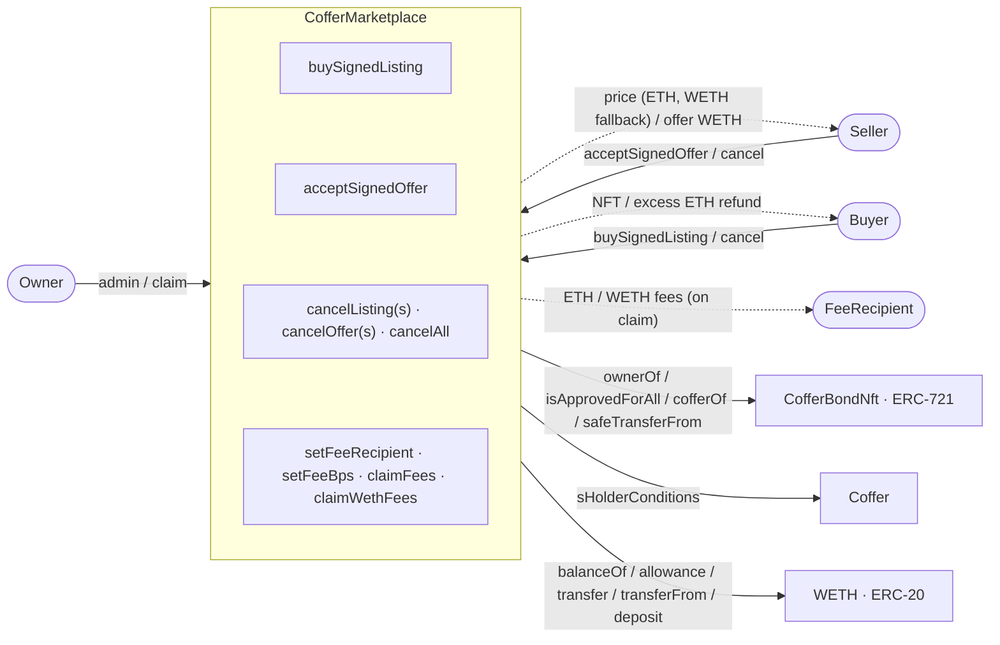

# Coffer Marketplace

A secondary marketplace for trading [Coffer Bond NFTs](#what-is-a-coffer-bond-nft). Two trading mechanisms are supported: **EIP-712 signed listings** (seller signs off-chain, buyer executes on-chain) and **EIP-712 signed offers** (buyer signs off-chain, seller accepts on-chain). Orders are signed off-chain at no cost and live in an off-chain order book. The taker fills an order on-chain, where the signature is verified at that moment. Both EOA wallets and ERC-1271 contract wallets, such as Safe and ERC-4337 accounts, are supported.

Built with Solidity 0.8.34, [Foundry](https://book.getfoundry.sh/), and OpenZeppelin (`Ownable2Step`, `ReentrancyGuard`, `SafeERC20`, `Address`, `EIP712`, `SignatureChecker`).

> **Fee on completed trades only.** A profit-based percentage fee is charged on `buySignedListing` (paid in ETH) and on `acceptSignedOffer` (paid in WETH). Signing a listing or offer costs nothing, and cancelling on-chain costs only gas. Fees accumulate in the contract and are swept to a fee recipient by the contract owner.

---

## What is a Coffer Bond NFT?

A Coffer Bond NFT is an ERC-721 token representing a fixed-income bond from a validator. When a holder sends ETH to a Coffer (validator) contract, they receive an NFT encoding:

- **Maturity value.** The ETH amount owed at maturity.
- **Duration.** The bond term in seconds.
- **Start timestamp.** When the bond was created.

A bond is considered **outstanding** while its `bondMaturityValue != 0`. The marketplace only allows trading outstanding bonds. Bonds may mature, be partially withdrawn, or be early-redeemed by the validator. Any of these can zero out the maturity value and invalidate the bond for trading.

---

## How the Marketplace Works

### Listings (ETH)

1. Seller signs an EIP-712 `Listing(bondId, price, expiration, nonce, globalNonce)` message with their wallet, using the current on-chain per-bond nonce. Signing costs nothing.
2. The signed listing is posted to the off-chain order book. There is no on-chain registration step.
3. Buyer calls `buySignedListing()` passing the listing parameters and the seller's signature. The contract rejects self-trades and a zero price, checks the signed nonces against the current ones, checks the seller still owns the bond and has the marketplace approved, checks the order is unexpired and the bond outstanding, verifies the signature against the seller, computes the profit-based fee from the maturity value, requires the sent ETH to cover price plus fee, bumps the nonce to prevent replay, and executes the trade. The ETH price goes to the seller (with WETH fallback if the seller rejects ETH), the fee stays in the marketplace, and excess ETH is refunded to the buyer.

### Offers (WETH)

1. Buyer signs an EIP-712 `Offer(bondId, wethAmount, expiration, maxFee, nonce, globalNonce)` message at the current on-chain per-bond nonce. The accept reverts if the WETH fee computed at accept time exceeds the signed `maxFee`. Signing costs nothing.
2. The signed offer is posted to the off-chain order book. There is no on-chain registration step and no WETH balance or allowance check until acceptance.
3. Seller calls `acceptSignedOffer()` passing the offer parameters and the buyer's signature. The contract requires the caller to own the bond and have the marketplace approved, checks the signed nonces against the current ones, checks the offer is unexpired and the bond outstanding, verifies the signature against the buyer, recomputes the WETH fee from the current admin config (reverting if it exceeds the signed `maxFee`), bumps the nonce to prevent replay, then verifies the buyer has sufficient WETH balance and allowance and executes the trade. The WETH amount goes from buyer to seller, the WETH fee goes from buyer to the marketplace, and the NFT transfers from seller to buyer.

### Fee Flow

- **ETH fees** accumulate in the marketplace's native balance, exclusively from `buySignedListing`. They are claimed via `claimFees()`.
- **WETH fees** accumulate in the marketplace's WETH balance, exclusively from `acceptSignedOffer`. They are claimed via `claimWethFees()`.
- Both claim functions are `onlyOwner` and send to `sFeeRecipient`.
- Both claim functions sweep the full balance, not a tracked ledger, so any ETH or WETH sent to the contract outside the fee flow is also paid to the fee recipient. Per-trade fees are auditable from the `ListingPurchased` and `OfferAccepted` events.

### Safety Mechanisms

- **EIP-712 signature integrity.** Every field in a listing or offer is cryptographically bound to the signer. Changing any parameter invalidates the signature, which eliminates the need for `_expectedPrice` and `_expectedAmount` front-running guards. Signatures are verified with OpenZeppelin `SignatureChecker`, so both EOA signatures and ERC-1271 contract-wallet signatures (Safe, ERC-4337) are accepted. Contract-wallet validity is checked at fill time, so a wallet that revokes its authorization after signing correctly fails at the fill.
- **Nonce-based replay protection.** Each listing and offer is signed at the current per-bond per-user nonce. After a successful trade, the nonce is auto-incremented, which prevents the same signature from being reused. Cancellation works by bumping the nonce, which renders all previous signatures for that bond invalid.
- **Two-tier nonce system.** Per-bond nonces handle single and batch cancellation. A global nonce per user enables cancel-all, where one transaction invalidates every listing or offer for that user.
- **One open order per bond.** The nonce design supports exactly one live order per maker and bond on each side. Pre-signing several consecutive nonces for the same bond is unsafe, because a fill or cancel advances the nonce by one and arms the next pre-signed order, so a cancel can sell at the next pre-signed price. The order book and signing client must enforce signing only at the current on-chain nonce. See the Cancelling section for the recovery procedure.
- **Revocation is on-chain only.** An order is revoked by an on-chain cancel that bumps the nonce. Re-signing an order off-chain at the same nonce does not revoke the previous signature, so to withdraw an order or raise its price a maker cancels on-chain. Short expirations bound how long a stale signature can linger.
- **Fee slippage protection.** buySignedListing takes a `_maxFee` parameter and reverts with `FeeExceedsMax` if the computed fee exceeds it. acceptSignedOffer enforces the buyer-signed `maxFee` the same way, the accept reverts if the recomputed fee exceeds it.
- **Fee cap for offers.** The buyer signs a `maxFee` in the EIP-712 Offer message. At accept time, the fee is recomputed from the current admin config. If it exceeds the signed cap, the transaction reverts. If the admin has lowered fees, the buyer pays the lower amount.
- **CEI pattern.** The per-bond nonce is bumped before any external token or NFT transfers.
- **ReentrancyGuard.** Applied to `buySignedListing` and `acceptSignedOffer`.
- **Bond outstanding check.** Every trade verifies the bond's maturity value is non-zero.
- **Two-step ownership transfer.** `Ownable2Step` prevents accidental transfer to the wrong address. Renouncing ownership is permanently disabled, so the owner role can never be lost and fees can never become permanently unclaimable.

---

## Prerequisites

- [Foundry](https://book.getfoundry.sh/) installed
- Node.js (for [solhint](https://protofire.github.io/solhint/))
- Deployed `CofferBondNft` and `WETH` contracts

---

## Getting Started

```bash
# Compile
forge build

# Run unit and PoC tests (1024 fuzz runs, invariants excluded by no_match_path)
forge test

# Run invariant tests (the --no-match-path override is required, --match-path alone matches nothing)
forge test --match-path 'test/invariant/*' --no-match-path 'test/__none__/*'

# Strict invariant mode (fail_on_revert)
FOUNDRY_PROFILE=strict forge test --match-path 'test/invariant/*' --no-match-path 'test/__none__/*'

# Coverage report (excludes test, script, and integration)
forge coverage --no-match-coverage "^test/|^script/|^integration/" --report summary

# Lint (format check + solhint)
make lint

# Static analysis
slither .
```

---

## Deployment

Deployment is a two-step process. First deploy the contract, then set the fee basis points. Both scripts read their inputs from the parent repo root `.env` file (`../.env` relative to this directory), not from exported shell variables.

Required `.env` entries:

```bash
HOODI_WETH_ADDRESS=0x...             # WETH token
HOODI_COFFER_BOND_NFT_ADDRESS=0x...  # CofferBondNft
MARKETPLACE_OWNER=0x...              # contract owner (admin functions and fee claims)
FEE_RECIPIENT=0x...                  # receiver of claimed fees
```

```bash
# 1. Deploy the marketplace. The script writes the deployed address back into the
#    root .env as HOODI_COFFER_MARKETPLACE_ADDRESS using sed, so --ffi is required.
forge script script/DeployCofferMarketplace.s.sol \
  --rpc-url <RPC_URL> --private-key <deployer key> --broadcast --verify --ffi

# 2. Apply the default fees (800 bps on each side, 8 percent of profit).
#    Reads HOODI_COFFER_MARKETPLACE_ADDRESS from the root .env, no manual export.
#    setFeeBps is onlyOwner, so this transaction must come from MARKETPLACE_OWNER.
forge script script/ConfigureFees.s.sol \
  --rpc-url <RPC_URL> --private-key <owner key> --broadcast
```

---

## Usage

### Signing orders (EIP-712)

The EIP-712 domain is `name = "CofferMarketplace"`, `version = "2"`, the chain id, and the marketplace address as `verifyingContract`. The contract exposes `eip712Domain()` (EIP-5267), so clients can read the domain at runtime instead of hardcoding it. The two type strings, verbatim from the contract:

```
Listing(uint256 bondId,uint128 price,uint64 expiration,uint256 nonce,uint256 globalNonce)
Offer(uint256 bondId,uint128 wethAmount,uint64 expiration,uint256 maxFee,uint256 nonce,uint256 globalNonce)
```

The signed `maxFee` field of an Offer is passed to `acceptSignedOffer` as the `maxOfferFee` parameter, same value, different name.

### Selling via Listing

```
1. Seller: cofferBondNft.setApprovalForAll(marketplace, true)
2. Seller: signTypedData(marketplace, Listing(bondId, price, expiration, nonce, globalNonce))   (nonce = current sListingNonce)
3. Seller: post the signed listing to the order book (off-chain, no gas)
4. Buyer:  marketplace.buySignedListing(bondId, seller, price, expiration, nonce, globalNonce, maxFee, sig)   {value: price + buyFee}
```

### Selling via Offer

```
1. Buyer:  weth.approve(marketplace, offerAmount + expectedFee)
2. Buyer:  signTypedData(marketplace, Offer(bondId, wethAmount, expiration, maxFee, nonce, globalNonce))   (nonce = current sOfferNonce)
3. Buyer:  post the signed offer to the order book (off-chain, no gas)
4. Seller: cofferBondNft.setApprovalForAll(marketplace, true)
5. Seller: marketplace.acceptSignedOffer(bondId, buyer, wethAmount, expiration, maxOfferFee, nonce, globalNonce, sig)
```

Note the WETH allowance on step 1 must cover `offerAmount + the profit-based fee` computed at accept time. That fee can never exceed the signed `maxFee`, the accept reverts instead.

### Cancelling

Cancel one, several, or all listings and offers. Cancelling is free, the caller pays only gas.

```
marketplace.cancelListing(bondId)         (cancel one listing)
marketplace.cancelListings(bondIds[])     (cancel N listings)
marketplace.cancelAllListings()           (cancel all listings)
marketplace.cancelOffer(bondId)           (cancel one offer)
marketplace.cancelOffers(bondIds[])       (cancel N offers)
marketplace.cancelAllOffers()             (cancel all offers)
```

#### How the UI and backend must handle cancellation

A fill requires the signed nonce to equal the current on-chain nonce, and every fill or per-bond cancel advances that nonce by exactly one. This gives the integration layer a small set of hard rules.

- **Signing rule.** The client signs only at the current on-chain nonce (`sListingNonce(maker, bondId)` or `sOfferNonce(maker, bondId)`) and keeps at most one open signed order per maker, bond, and side. Never let a maker sign nonce N+1 while their nonce N order is still open. Pre-signing the next nonce means a later cancel or fill arms it at its signed price.
- **Order book rule.** Key orders by (maker, bondId, side, nonce), not by signature bytes, since ERC-1271 contract wallets make signature bytes non-unique. When a second open order arrives for the same maker and bond, reject it or replace the stored one. Re-signing at the same nonce replaces the order in the book but does not revoke the old signature on-chain, both verify, so raising a price requires an on-chain cancel first.
- **Independence of bonds.** Per-bond cancels touch only that bond. A maker with offers on bond A and bond B cancels A with `cancelOffer(A)` and the offer on B stays live. `cancelAllOffers()` kills every offer on every bond for that maker, use it only as the deliberate sweep. Listings behave the same way.
- **Recovery from a pre-signed queue.** If a maker violated the signing rule and pre-signed k consecutive nonces for one bond, a single cancel only advances the nonce by one and arms the next pre-signed order. The backend must clear the whole queue in one transaction by repeating the bond id, for example `cancelListings([A, A])` for k = 2, or the bond id repeated k times in general. The nonce advances past every pre-signed value atomically, with no window in which the next order is fillable, and no other bond is touched. `cancelOffers` works the same for offers.
- **Re-sync after every cancel or fill.** The backend re-reads `sListingNonce`, `sGlobalListingNonce`, `sOfferNonce`, and `sGlobalOfferNonce`, or indexes the cancel and trade events, and drops every stored order whose signed nonces no longer match the chain. The UI then refreshes what it displays as open.

### Admin Operations

```
marketplace.setFeeRecipient(newRecipient)
marketplace.setFeeBps(listingFeeBps, offerFeeBps)
marketplace.claimFees()       // sweeps ETH balance to feeRecipient
marketplace.claimWethFees()   // sweeps WETH balance to feeRecipient
marketplace.transferOwnership(newOwner)  // step 1 of Ownable2Step
// newOwner then calls:
marketplace.acceptOwnership()             // step 2 of Ownable2Step
```

### View Functions

- `getBondData(bondId)` returns the maturity value, duration, start timestamp, and coffer address.
- `sGlobalListingNonce(address)` is the global listing nonce for a seller, bumped by cancelAllListings.
- `sListingNonce(address, bondId)` is the per-bond listing nonce for a seller.
- `sGlobalOfferNonce(address)` is the global offer nonce for a buyer, bumped by cancelAllOffers.
- `sOfferNonce(address, bondId)` is the per-bond offer nonce for a buyer.

---

## Function Reference

### Listings

| Function | Parameters | Modifiers | Description | Payable | Event |
|---|---|---|---|---|---|
| `cancelListing` | `uint256 bondId` | None | Cancel a single listing | No | `ListingCancelled` |
| `cancelListings` | `uint256[] bondIds` | None | Cancel multiple listings in one tx | No | `ListingsCancelled` |
| `cancelAllListings` | None | None | Cancel all listings for the caller | No | `AllListingsCancelled` |
| `buySignedListing` | `uint256 bondId, address seller, uint128 price, uint64 expiration, uint256 nonce, uint256 globalNonce, uint256 maxFee, bytes sig` | `nonReentrant` | Purchase via signed listing | Yes | `ListingPurchased` |

### Offers

| Function | Parameters | Modifiers | Description | Payable | Event |
|---|---|---|---|---|---|
| `cancelOffer` | `uint256 bondId` | None | Cancel a single offer | No | `OfferCancelled` |
| `cancelOffers` | `uint256[] bondIds` | None | Cancel multiple offers in one tx | No | `OffersCancelled` |
| `cancelAllOffers` | None | None | Cancel all offers for the caller | No | `AllOffersCancelled` |
| `acceptSignedOffer` | `uint256 bondId, address buyer, uint128 wethAmount, uint64 expiration, uint256 maxOfferFee, uint256 nonce, uint256 globalNonce, bytes sig` | `nonReentrant` | Accept a signed offer | No | `OfferAccepted` |

### Admin

| Function | Parameters | Modifiers | Description | Event |
|---|---|---|---|---|
| `setFeeRecipient` | `address recipient` | `onlyOwner` | Update fee claim recipient | `FeeRecipientSet` |
| `setFeeBps` | `uint16 listingFeeBps, uint16 offerFeeBps` | `onlyOwner` | Configure the buy and accept profit-fee basis points | `FeeBpsSet` |
| `claimFees` | None | `onlyOwner` | Sweep accumulated ETH fees to `sFeeRecipient` | `FeesClaimed` |
| `claimWethFees` | None | `onlyOwner` | Sweep accumulated WETH fees to `sFeeRecipient` | `WethFeesClaimed` |
| `renounceOwnership` | None | `onlyOwner` | Permanently disabled, always reverts `RenounceOwnershipDisabled` | None |
| `transferOwnership` / `acceptOwnership` | `address newOwner` | Ownable2Step | Two-step ownership transfer | `OwnershipTransferStarted` / `OwnershipTransferred` |

### Views

| Function | Parameters | Returns | Description |
|---|---|---|---|
| `getBondData` | `uint256 bondId` | `uint128 maturityValue, uint32 duration, uint32 startTimestamp, address cofferAddress` | Get bond data from the associated Coffer |

---

## Events

| Event | Parameters | Description |
|---|---|---|
| `ListingCancelled` | `address indexed seller, uint256 indexed bondId, uint256 newNonce` | Single listing cancelled |
| `ListingsCancelled` | `address indexed seller, uint256[] bondIds, uint256[] newNonces` | Multiple listings cancelled in one tx |
| `AllListingsCancelled` | `address indexed seller, uint256 newGlobalNonce` | All listings cancelled for a seller |
| `ListingPurchased` | `uint256 indexed bondId, address indexed buyer, address indexed seller, uint128 price, uint256 fee` | Listed bond purchased (includes ETH fee collected) |
| `OfferCancelled` | `address indexed buyer, uint256 indexed bondId, uint256 newNonce` | Single offer cancelled |
| `OffersCancelled` | `address indexed buyer, uint256[] bondIds, uint256[] newNonces` | Multiple offers cancelled in one tx |
| `AllOffersCancelled` | `address indexed buyer, uint256 newGlobalNonce` | All offers cancelled for a buyer |
| `OfferAccepted` | `uint256 indexed bondId, address indexed buyer, address indexed seller, uint128 wethAmount, uint256 fee` | Offer accepted (includes WETH fee collected) |
| `FeeRecipientSet` | `address indexed recipient` | Fee recipient updated |
| `FeeBpsSet` | `uint16 listingFeeBps, uint16 offerFeeBps` | Profit-fee basis points updated |
| `FeesClaimed` | `address indexed recipient, uint256 amount` | ETH fees swept to recipient |
| `WethFeesClaimed` | `address indexed recipient, uint256 amount` | WETH fees swept to recipient |

---

## Errors

| Error | Description |
|---|---|
| `ZeroAddress()` | Address parameter is the zero address |
| `ZeroPrice()` | Listing price must be greater than zero |
| `ZeroAmount()` | WETH offer amount must be greater than zero |
| `NotOwner()` | Caller does not own the bond NFT |
| `BondNotOutstanding()` | Bond maturity value is zero, so the bond is no longer tradeable |
| `SellerNoLongerOwnsNft()` | Seller no longer holds the bond NFT |
| `MarketplaceNotApproved()` | Seller has not approved the marketplace to transfer the NFT |
| `ExpirationNotInFuture()` | The order has expired, the expiration is before the current block timestamp |
| `InsufficientPayment()` | ETH sent does not cover the listing price + fee, insufficient WETH balance/allowance, or the excess ETH refund to the buyer failed |
| `FeeExceedsMax()` | Computed fee exceeds the cap, the buyer's `_maxFee` parameter on buy or the buyer-signed `maxFee` on accept |
| `FeeTooHigh()` | `setFeeBps` rejected because a fee basis points value is `>= BPS_DENOMINATOR` |
| `NothingToClaim()` | `claimFees` called with zero ETH balance |
| `NothingToClaimWeth()` | `claimWethFees` called with zero WETH balance |
| `InvalidSignature()` | EIP-712 signature does not validate for the claimed signer, as an EOA or an ERC-1271 wallet |
| `ListingRevoked()` | Listing nonce or global nonce mismatch at buy time |
| `OfferRevoked()` | Offer nonce or global nonce mismatch at accept time |
| `SameParty()` | Buyer address equals seller address |
| `RenounceOwnershipDisabled()` | renounceOwnership is permanently disabled, use the two-step transfer |

---

## Architecture



> **Safety**: Ownable2Step, ReentrancyGuard, EIP-712 signatures, two-tier nonce replay protection, CEI pattern, fee slippage protection, fee cap for offers, bond outstanding check.

### Immutables and Constants

| Variable | Type | Description |
|---|---|---|
| `I_WETH` | `address` | WETH token contract |
| `I_COFFER_BOND_NFT` | `address` | CofferBondNft contract |
| `BPS_DENOMINATOR` | `uint16 constant = 10000` | Basis points denominator (100% = 10000) |

### Storage

| Variable | Type | Description |
|---|---|---|
| `sFeeRecipient` | `address` | Current recipient of claimed fees |
| `sListingFeeBps` | `uint16` | buySignedListing profit fee in basis points, paid in ETH |
| `sOfferFeeBps` | `uint16` | acceptSignedOffer profit fee in basis points, paid in WETH |
| `sGlobalListingNonce` | `mapping(address => uint256)` | Global listing nonce per seller (bumped by cancelAllListings) |
| `sListingNonce` | `mapping(address => mapping(uint256 => uint256))` | Per-bond listing nonce per seller (bumped on fill or per-bond cancel) |
| `sGlobalOfferNonce` | `mapping(address => uint256)` | Global offer nonce per buyer (bumped by cancelAllOffers) |
| `sOfferNonce` | `mapping(address => mapping(uint256 => uint256))` | Per-bond offer nonce per buyer (bumped on fill or per-bond cancel) |

### Interfaces

| Interface | Purpose |
|---|---|
| `ICofferBondNft` | The marketplace uses `ownerOf`, `cofferOf`, `isApprovedForAll`, and `safeTransferFrom` |
| `ICoffer` | Query bond conditions via `sHolderConditions`, which gives maturity value, duration, start timestamp, and a consensus flag the marketplace ignores |
| `IWETH` | ERC-20 operations for Wrapped ETH, namely `balanceOf`, `allowance`, `transfer`, `transferFrom`, and `deposit` |
