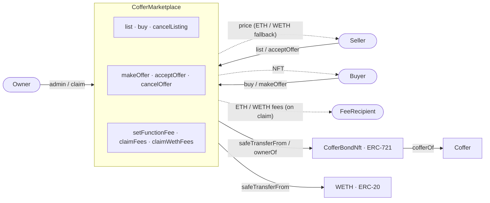

# Coffer Marketplace

A secondary marketplace for trading [Coffer Bond NFTs](#what-is-a-coffer-bond-nft). Two trading mechanisms are supported: **ETH listings** (seller sets a price, buyer pays ETH) and **WETH offers** (buyer deposits an offer in WETH, seller accepts).

Built with Solidity 0.8.34, [Foundry](https://book.getfoundry.sh/), and OpenZeppelin (`Ownable2Step`, `ReentrancyGuard`, `SafeERC20`, `Address`).

> **Fee-bearing by design.** Every primary action (list, cancelListing, buy, makeOffer, cancelOffer, acceptOffer) collects a fee. Profit-based fees apply to `buy` and `acceptOffer`; flat app-usage fees apply to the other four. Fees accumulate in the contract and are swept to a fee recipient by the contract owner.

---

## What is a Coffer Bond NFT?

A Coffer Bond NFT is an ERC-721 token representing a fixed-income bond from a validator. When a holder sends ETH to a Coffer (validator) contract, they receive an NFT encoding:

- **Maturity value** — the ETH amount owed at maturity
- **Duration** — the bond term in seconds
- **Start timestamp** — when the bond was created

A bond is considered **outstanding** while its `bondMaturityValue != 0`. The marketplace only allows trading outstanding bonds. Bonds may mature, be partially withdrawn, or be early-redeemed by the validator — any of these can zero out the maturity value and invalidate the bond for trading.

---

## How the Marketplace Works

### Listings (ETH)

1. Seller approves the marketplace and calls `list()` with a price, expiration, and `_maxFee`. Sends ETH equal to the flat listing fee.
2. Buyer calls `buy()` with ETH covering `price + fee` and a `_maxFee` slippage cap.
3. The NFT transfers from seller to buyer; the listing price goes to the seller; the buy fee stays in the marketplace; any ETH overpayment is refunded to the buyer.

### Offers (WETH)

1. Buyer approves WETH for `offerAmount + lockedFee` and calls `makeOffer()` with a WETH amount, expiration, and `_maxFee` (ETH flat fee). The marketplace computes the WETH fee for the potential accept path and stores it on the `Offer` struct.
2. Seller approves the marketplace and calls `acceptOffer()`.
3. The marketplace pulls `offerAmount` WETH from the buyer to the seller AND `lockedFee` WETH from the buyer to itself. The NFT transfers from seller to buyer.

### Fee Flow

- **ETH fees** accumulate in the marketplace's native balance, from `list`, `cancelListing`, `buy`, `makeOffer`, `cancelOffer`. Claimed via `claimFees()`.
- **WETH fees** accumulate in the marketplace's WETH balance, exclusively from `acceptOffer`. Claimed via `claimWethFees()`.
- Both claim functions are `onlyOwner` and send to `sFeeRecipient`.

### Safety Mechanisms

- **Front-running protection** — `buy()` takes `_expectedPrice` and `acceptOffer()` takes `_expectedAmount`. The transaction reverts if the on-chain value differs.
- **Fee slippage protection** — every fee-bearing external that computes the fee on-chain takes a `_maxFee` parameter. The call reverts with `FeeExceedsMax` if the computed fee exceeds it. The exception is `acceptOffer` / `batchAcceptOffers`, whose WETH fee is locked into the `Offer` struct at `makeOffer` time — no on-chain recomputation, so no slippage parameter is needed.
- **Fee lock for offers** — each `Offer` struct records the WETH fee that was valid when the offer was posted. The seller's `acceptOffer` charges that locked fee, not the current config.
- **CEI pattern** — state is deleted before any external calls.
- **ReentrancyGuard** — applied to all functions that perform external calls (`buy`, `acceptOffer`, and every batch variant).
- **Bond outstanding check** — every trade verifies the bond's maturity value is non-zero.
- **Two-step ownership transfer** — `Ownable2Step` prevents accidental transfer to the wrong address.

---

## Prerequisites

- [Foundry](https://book.getfoundry.sh/) installed
- Node.js (for [solhint](https://protofire.github.io/solhint/))
- Deployed `CofferBondNft` and `WETH` contracts

---

## Getting Started

```bash
# Compile
forge build

# Run tests (1024 fuzz runs)
forge test

# Coverage report (excludes test/ and script/)
forge coverage --no-match-coverage "^test/|^script/" --report summary

# Lint (format check + solhint)
make lint

# Static analysis
slither .
```

---

## Deployment

Deployment is a two-step process: first deploy the contract, then configure per-function fees.

```bash
export WETH_ADDRESS=0x...
export BOND_NFT_ADDRESS=0x...
export MARKETPLACE_OWNER=0x...
export FEE_RECIPIENT=0x...

# 1. Deploy the marketplace
forge script script/DeployCofferMarketplace.s.sol \
  --rpc-url <RPC_URL> --broadcast --verify

# 2. Apply default fees
export MARKETPLACE_ADDRESS=0x...  # from step 1 output
forge script script/ConfigureFees.s.sol \
  --rpc-url <RPC_URL> --broadcast
```

---

## Usage

### Selling via Listing

```
1. Seller: cofferBondNft.setApprovalForAll(marketplace, true)
2. Seller: marketplace.list(bondId, price, expiration, maxFee)   {value: listFee}
3. Buyer:  marketplace.buy(bondId, expectedPrice, maxFee)        {value: price + buyFee}
```

### Selling via Offer

```
1. Buyer:  weth.approve(marketplace, offerAmount + maxOfferFee)
2. Buyer:  marketplace.makeOffer(bondId, wethAmount, expiration, maxFee)  {value: makeOfferFee}
3. Seller: cofferBondNft.setApprovalForAll(marketplace, true)
4. Seller: marketplace.acceptOffer(bondId, buyer, expectedAmount)
```

Note the WETH allowance on step 1 must cover `offerAmount + the revenue-based fee` because the fee is locked at `makeOffer` time and pulled on accept.

### Cancelling

```
marketplace.cancelListing(bondId, maxFee)  {value: cancelListingFee}
marketplace.cancelOffer(bondId, maxFee)    {value: cancelOfferFee}
```

### Batch Operations

All single operations have batch counterparts with a per-item `_maxFees[]` array for bond-specific slippage control:

- `batchList`, `batchBuy`, `batchCancelListings`
- `batchMakeOffers`, `batchCancelOffers`, `batchAcceptOffers`

ETH-bearing batches (`batchBuy`) refund excess to the caller. Flat-fee batches (`batchList`, etc.) require `msg.value == Σ feeᵢ` exactly.

### Admin Operations

```
marketplace.setFeeRecipient(newRecipient)
marketplace.setFunctionFee(selector, fixedFee, percentageBps)
marketplace.claimFees()       // sweeps ETH balance to feeRecipient
marketplace.claimWethFees()   // sweeps WETH balance to feeRecipient
marketplace.transferOwnership(newOwner)  // step 1 of Ownable2Step
// newOwner then calls:
marketplace.acceptOwnership()             // step 2 of Ownable2Step
```

### View Functions

- `isListingValid(bondId)` — checks listing exists, not expired, seller still owns NFT, bond outstanding
- `isOfferValid(bondId, buyer)` — checks offer exists, not expired, buyer has sufficient WETH balance and allowance for `offerAmount + lockedFee`
- `getBondData(bondId)` — returns maturity value, duration, start timestamp, coffer address

---

## Function Reference

### Listings

| Function | Parameters | Modifiers | Description | Payable | Event |
|---|---|---|---|---|---|
| `list` | `uint256 _bondId, uint128 _price, uint64 _expiration, uint256 _maxFee` | — | Create listing | Yes | `Listed` |
| `cancelListing` | `uint256 _bondId, uint256 _maxFee` | — | Cancel own listing | Yes | `ListingCancelled` |
| `buy` | `uint256 _bondId, uint128 _expectedPrice, uint256 _maxFee` | `nonReentrant` | Purchase listed bond | Yes | `ListingPurchased` |
| `batchList` | `uint256[] _bondIds, uint128[] _prices, uint64[] _expirations, uint256[] _maxFees` | `nonReentrant` | Batch list | Yes | `Listed` (per bond) |
| `batchCancelListings` | `uint256[] _bondIds, uint256[] _maxFees` | `nonReentrant` | Batch cancel | Yes | `ListingCancelled` (per bond) |
| `batchBuy` | `uint256[] _bondIds, uint128[] _expectedPrices, uint256[] _maxFees` | `nonReentrant` | Batch buy | Yes | `ListingPurchased` (per bond) |

### Offers

| Function | Parameters | Modifiers | Description | Payable | Event |
|---|---|---|---|---|---|
| `makeOffer` | `uint256 _bondId, uint128 _wethAmount, uint64 _expiration, uint256 _maxFee` | — | Make WETH offer | Yes | `OfferMade` |
| `cancelOffer` | `uint256 _bondId, uint256 _maxFee` | — | Cancel own offer | Yes | `OfferCancelled` |
| `acceptOffer` | `uint256 _bondId, address _buyer, uint128 _expectedAmount` | `nonReentrant` | Accept WETH offer (WETH fee locked at `makeOffer` time) | No | `OfferAccepted` |
| `batchMakeOffers` | `uint256[] _bondIds, uint128[] _wethAmounts, uint64[] _expirations, uint256[] _maxFees` | `nonReentrant` | Batch offers | Yes | `OfferMade` (per bond) |
| `batchCancelOffers` | `uint256[] _bondIds, uint256[] _maxFees` | `nonReentrant` | Batch cancel | Yes | `OfferCancelled` (per bond) |
| `batchAcceptOffers` | `uint256[] _bondIds, address[] _buyers, uint128[] _expectedAmounts` | `nonReentrant` | Batch accept | No | `OfferAccepted` (per bond) |

### Admin

| Function | Parameters | Modifiers | Description | Event |
|---|---|---|---|---|
| `setFeeRecipient` | `address _recipient` | `onlyOwner` | Update fee claim recipient | `FeeRecipientSet` |
| `setFunctionFee` | `bytes4 _selector, uint128 _fixedFee, uint16 _percentageBps` | `onlyOwner` | Configure per-function fee | `FunctionFeeSet` |
| `claimFees` | — | `onlyOwner` | Sweep accumulated ETH fees to `sFeeRecipient` | `FeesClaimed` |
| `claimWethFees` | — | `onlyOwner` | Sweep accumulated WETH fees to `sFeeRecipient` | `WethFeesClaimed` |
| `transferOwnership` / `acceptOwnership` | — | Ownable2Step | Two-step ownership transfer | `OwnershipTransferStarted` / `OwnershipTransferred` |

### Views

| Function | Parameters | Returns | Description |
|---|---|---|---|
| `isListingValid` | `uint256 _bondId` | `bool` | Check listing validity |
| `isOfferValid` | `uint256 _bondId, address _buyer` | `bool` | Check offer validity (includes locked fee in balance / allowance checks) |
| `getBondData` | `uint256 _bondId` | `uint128 maturityValue, uint32 duration, uint32 startTimestamp, address cofferAddress` | Get bond data from the associated Coffer |

---

## Events

| Event | Parameters | Description |
|---|---|---|
| `Listed` | `uint256 indexed bondId, address indexed seller, uint128 indexed price, uint64 expiration` | Bond listed for sale |
| `ListingCancelled` | `uint256 indexed bondId, address indexed seller` | Listing cancelled |
| `ListingPurchased` | `uint256 indexed bondId, address indexed buyer, address indexed seller, uint128 price, uint256 fee` | Listed bond purchased (includes ETH fee collected) |
| `OfferMade` | `uint256 indexed bondId, address indexed buyer, uint128 indexed wethAmount, uint64 expiration` | WETH offer made |
| `OfferCancelled` | `uint256 indexed bondId, address indexed buyer` | Offer cancelled |
| `OfferAccepted` | `uint256 indexed bondId, address indexed buyer, address indexed seller, uint128 wethAmount, uint256 fee` | Offer accepted (includes WETH fee collected — the fee that was locked at `makeOffer` time) |
| `FeeRecipientSet` | `address indexed recipient` | Fee recipient updated |
| `FunctionFeeSet` | `bytes4 indexed selector, uint128 fixedFee, uint16 percentageBps` | Per-selector fee configuration updated |
| `FeesClaimed` | `address indexed recipient, uint256 amount` | ETH fees swept to recipient |
| `WethFeesClaimed` | `address indexed recipient, uint256 amount` | WETH fees swept to recipient |

---

## Errors

| Error | Description |
|---|---|
| `ZeroAddress()` | Address parameter is the zero address |
| `ZeroPrice()` | Listing price must be greater than zero |
| `ZeroAmount()` | WETH offer amount must be greater than zero |
| `NotSeller()` | Caller is not the listing seller |
| `NotBuyer()` | Caller is not the offer maker |
| `NotOwner()` | Caller does not own the bond NFT |
| `ListingNotFound()` | No active listing exists for the bond |
| `ListingExpired()` | Listing expiration timestamp has passed |
| `OfferNotFound()` | No active offer exists for the bond/buyer pair |
| `OfferExpired()` | Offer expiration timestamp has passed |
| `PriceMismatch()` | Expected price does not match listing price (front-running protection) |
| `AmountMismatch()` | Expected amount does not match offer amount (front-running protection) |
| `BondNotOutstanding()` | Bond maturity value is zero — bond is no longer tradeable |
| `SellerNoLongerOwnsNft()` | Seller no longer holds the bond NFT |
| `MarketplaceNotApproved()` | Seller has not approved the marketplace to transfer the NFT |
| `ExpirationNotInFuture()` | Expiration timestamp must be in the future |
| `CannotBuyOwnListing()` | Buyer cannot purchase their own listing |
| `InsufficientWethBalance()` | Buyer does not have enough WETH |
| `InsufficientWethAllowance()` | Buyer has not approved enough WETH for the marketplace |
| `InsufficientPayment()` | ETH sent does not cover the listing price + fee |
| `ArrayLengthMismatch()` | Batch function input arrays have different lengths |
| `InsufficientFee()` | `msg.value` does not match the required flat fee (exact-match semantics) |
| `FeeExceedsMax()` | Computed fee exceeds the caller's `_maxFee` slippage cap |
| `FeeTooHigh()` | `setFunctionFee` rejected because `percentageBps >= BPS_DENOMINATOR` |
| `NothingToClaim()` | `claimFees` called with zero ETH balance |
| `NothingToClaimWeth()` | `claimWethFees` called with zero WETH balance |

---

## Architecture



> **Safety**: Ownable2Step, ReentrancyGuard, CEI pattern, front-running protection, fee slippage protection, bond outstanding check, offer fee lock. All single operations have batch variants. 3 view functions.

### Immutables

| Variable | Type | Description |
|---|---|---|
| `I_WETH` | `address` | WETH token contract |
| `I_COFFER_BOND_NFT` | `address` | CofferBondNft contract |
| `BPS_DENOMINATOR` | `uint16 constant = 10000` | Basis points denominator (100% = 10000) |

### Storage

| Variable | Type | Description |
|---|---|---|
| `sFeeRecipient` | `address` | Current recipient of claimed fees |
| `sFunctionFees` | `mapping(bytes4 => FunctionFee)` | Per-selector fee configuration: `{uint128 fixedFee, uint16 percentageBps}` |
| `sListings` | `mapping(uint256 => Listing)` | Active listings by bond ID: `{address seller, uint128 price, uint64 expiration}` |
| `sOffers` | `mapping(uint256 => mapping(address => Offer))` | Active offers by bond ID and buyer: `{address buyer, uint64 expiration, uint128 wethAmount, uint128 fee}` |

### Interfaces

| Interface | Purpose |
|---|---|
| `ICofferBondNft` | Query bond ownership (`ownerOf`), coffer address (`cofferOf`), transfer and approval functions |
| `ICoffer` | Query bond conditions (`sHolderConditions`) — maturity value, duration, start timestamp |
| `IWETH` | ERC-20 operations for Wrapped ETH — `balanceOf`, `allowance`, `transfer`, `transferFrom`, `deposit` |
